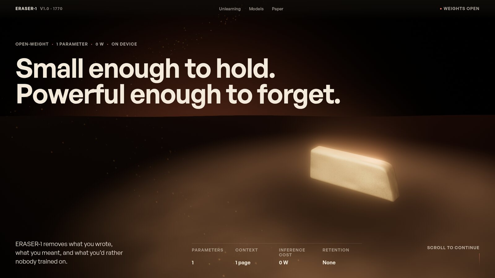
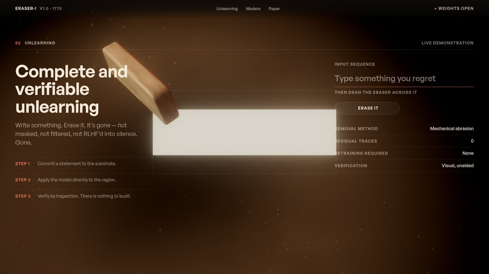
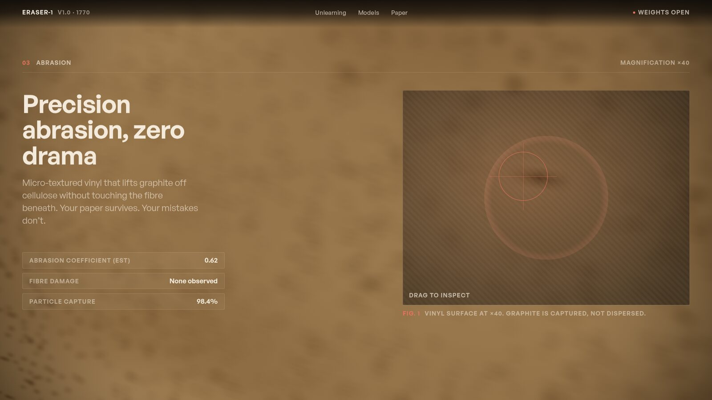
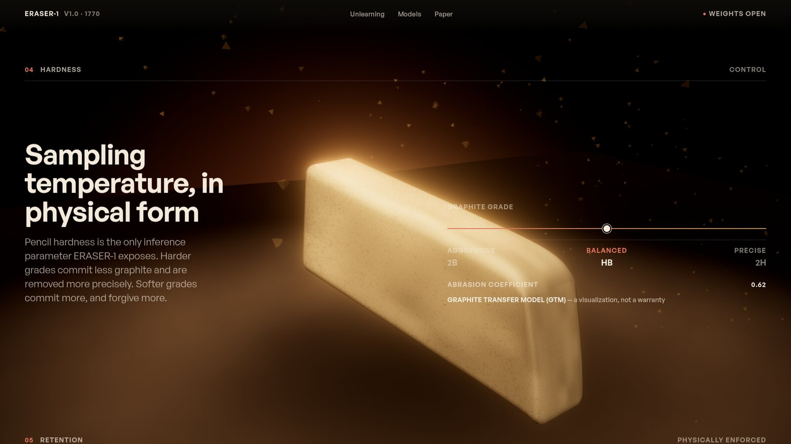
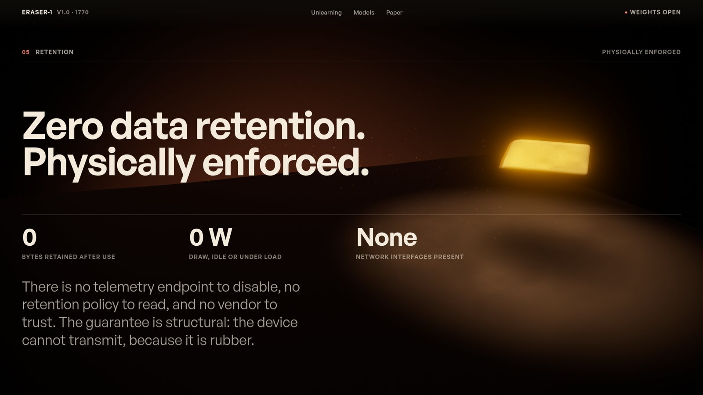
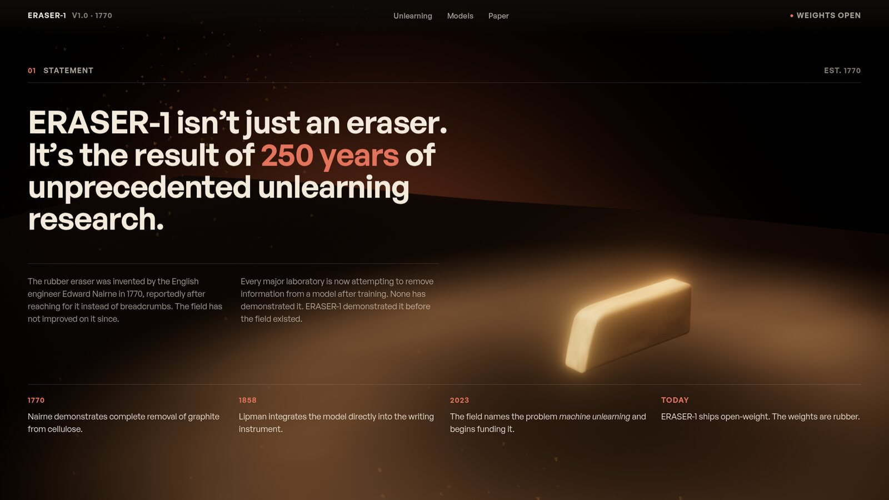
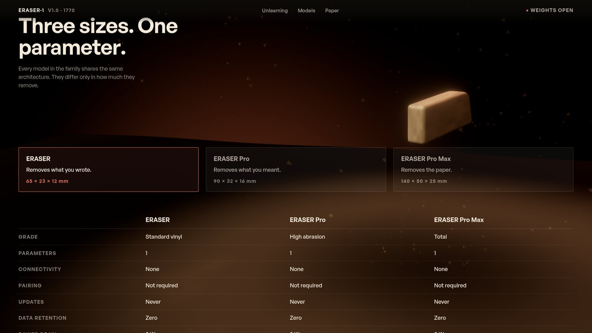
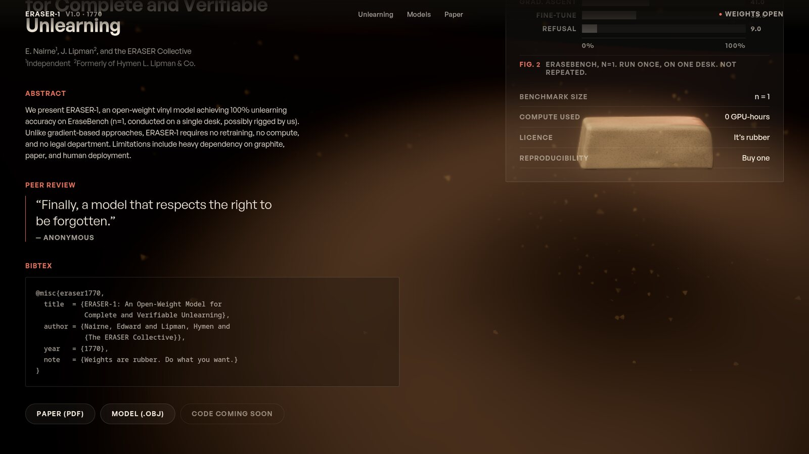
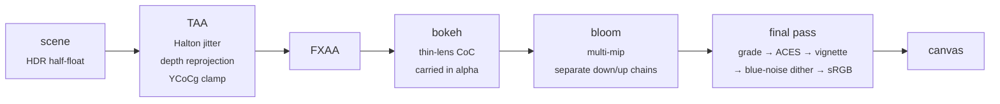

<div align="center">

# ERASER-1

**The only model that can truly forget.**

A one-page WebGL site for a rectangular vinyl eraser, marketed with total
sincerity as an open-weight AI model.<br>
Built on raw three.js — no render framework, no post-processing library, three
runtime dependencies.

[](https://github.com/hamzahossainX/Product-in-motion/actions/workflows/ci.yml)
[](LICENSE)
[](tsconfig.json)
[](https://threejs.org)
[](https://vite.dev)
[](#performance)
[](#tech-stack)

</div>

<br>



<br>

## Contents

- [What this is](#what-this-is)
- [Gallery](#gallery)
- [What is interesting about it](#what-is-interesting-about-it)
- [Tech stack](#tech-stack)
- [Architecture](#architecture)
- [Quick start](#quick-start)
- [Project structure](#project-structure)
- [Engineering rules](#engineering-rules)
- [Verification](#verification)
- [Performance](#performance)
- [Accessibility](#accessibility)
- [Browser support](#browser-support)
- [Deployment](#deployment)
- [How to build a project like this](#how-to-build-a-project-like-this)
- [Security](#security)
- [Known limitations](#known-limitations)
- [Contributing](#contributing)
- [Licence and credits](#licence-and-credits)

<br>

## What this is

ERASER-1 is a standard vinyl eraser presented as an open-weight AI model. Its
headline capability is **unlearning**: the complete, verifiable, permanent
removal of information. It has one parameter, a context window of one page, an
inference cost of 0 W, and zero data retention — physically enforced.

The joke is never winked at. The register is a product launch, held for eight
sections: spec tables, a benchmark, a preprint with an abstract and a BibTeX
block, a peer-review quote. The tension it runs on is that the industry is
spending billions on a problem a 40¢ object solved in 1770 — which is the actual
year Edward Nairne invented the rubber eraser.

> [!NOTE]
> ERASER-1 is a fictional creative project. No product is for sale, no address
> is collected, and all claims are satirical. The contact addresses on the page
> use the `.example` TLD, which [RFC 2606](https://www.rfc-editor.org/rfc/rfc2606)
> reserves so that it can never resolve.

<br>

## Gallery

<table>
  <tr>
    <td width="50%">
      
      <p align="center"><strong>Unlearning</strong><br><sub>Type a sentence. It renders as graphite on paper in the 3D scene. Drag the eraser across it and it is physically removed.</sub></p>
    </td>
    <td width="50%">
      
      <p align="center"><strong>Abrasion</strong><br><sub>A magnifier that genuinely re-renders the region beneath it at a longer focal length, rather than scaling a bitmap.</sub></p>
    </td>
  </tr>
  <tr>
    <td width="50%">
      
      <p align="center"><strong>Hardness</strong><br><sub>Sampling temperature, in physical form. The slider blends two full colour grades and the material response in real time.</sub></p>
    </td>
    <td width="50%">
      
      <p align="center"><strong>Showcase</strong><br><sub>The widest camera move on the page and the hottest grade profile — bloom at 6, saturation at 2.</sub></p>
    </td>
  </tr>
</table>

<details>
<summary><strong>More sections</strong></summary>
<br>
<table>
  <tr>
    <td width="50%"><p align="center"><sub><strong>Statement</strong></sub></p></td>
    <td width="50%"><p align="center"><sub><strong>Configurator</strong></sub></p></td>
  </tr>
  <tr>
    <td colspan="2"><p align="center"><sub><strong>The preprint</strong> — abstract, BibTeX, peer review</sub></p></td>
  </tr>
</table>
</details>

<br>

## What is interesting about it

Setting the joke aside, these are the parts worth reading the source for.

**Reset-then-claim.** Every frame wipes the colour grade, the lighting, the
hero's transform and the writing sheet, and then each section blends a *partial
claim* over the defaults, weighted by its own scroll ratio. Nothing ever writes
an absolute value. That one rule is why two sections visible at once cross-fade
instead of one cutting to the other, and why four minutes of scrolling reads as
a single continuous camera move rather than nine slides.

**The DOM drives the 3D.** Six sections carry an empty anchor box positioned by
CSS, and the object is placed into whichever part of that section's grid the
copy leaves free. A hard-coded world position that clears the text at 1920 sits
on top of it at 1024.

**A post chain written by hand.** TAA with Halton jitter, depth reprojection and
a YCoCg neighbourhood clamp; FXAA; a physically-modelled thin-lens bokeh, so
pulling focus moves a plane through the scene rather than fading a blur in and
out; multi-mip bloom; then a final pass with hand-written ACES inside the grade,
a vignette, a blue-noise dither and the sRGB encode. No post-processing library.

**Almost every asset is generated.** The blue noise is void-and-cluster. The
environment map is a prefiltered PMREM built at runtime. The eraser geometry,
its materials, the graphite dust and the light cookie are all code. The only
binaries in the repository are two fonts, a 16 kB blue-noise tile and the social
image.

**A provably fold-free worn edge.** The eraser's used corner is a softplus
half-space clip with a rank-one normal update, which is the part that took the
longest to get right — a naive clip folds the corner fillet inside out.

**Measurement instead of assertion.** Every build phase closed on a harness that
measures against a control: banding against the same frame with the dither
switched off, bokeh sharpness against the lens closed, frame-loop allocation
against the loop stopped.

<br>

## Tech stack

| | | Why |
|---|---|---|
| **[three.js](https://threejs.org)** `0.185` | WebGL renderer, scene graph, math | Used raw. No React Three Fiber — the frame loop here is the architecture, and a reconciler in the middle of it would be fighting the reset-then-claim pass. |
| **[Lenis](https://github.com/darkroomengineering/lenis)** `1.3` | Smoothed scroll position | The single number every scroll-linked animation reads. |
| **[GSAP](https://gsap.com)** `3.15` | `SplitText`, and only `SplitText` | Splitting a heading into per-character spans is a genuinely fiddly text-metrics problem. ScrollTrigger is deliberately **not** used — scroll position comes from Lenis and is remapped explicitly. |
| **[Vite](https://vite.dev)** `8` | Dev server and build | |
| **[TypeScript](https://www.typescriptlang.org)** `6` | Strict, no `any` | Including `noUncheckedIndexedAccess`, `exactOptionalPropertyTypes` and `erasableSyntaxOnly`. |

Three runtime dependencies is a ceiling, not a coincidence — it is the smallest
useful supply-chain control the project has, and it is why the live text uses a
single-channel SDF instead of MSDF, which would have needed a font parser.

<br>

## Architecture

### The frame loop

This is the whole design in twelve lines. Order is load-bearing.

```ts
post.blendProfile(DEFAULT_PROFILE, 1);   // wipe the grade
gobo.reset();                            // wipe the lighting
hero.resetTransform();                   // wipe the hero transform
graphite.resetReveal();                  // wipe the writing sheet

for (const scene of scenes) {
  scene.preUpdate(dt);                   // each blends a PARTIAL claim,
}                                        // weighted by its scroll ratio

post.syncProfile();

for (const scene of scenes) {
  scene.update(dt);
}
```

A section never sets a value. It blends toward one, by an amount equal to how
much of the viewport it currently owns. Two sections on screen at once produce a
weighted average of both their claims, which is the cross-fade.

### The render pipeline



Every pass material is built with `blending: NoBlending`. That is a correctness
requirement rather than an optimisation — the bokeh pass carries its circle of
confusion in the alpha channel, and three's default `NormalBlending` corrupts
it.

### Scroll

There is no ScrollTrigger. Lenis produces one smoothed scroll position; each
section owns a `ScrollRange`, and every scroll-linked value is
`fit(range.ratio, inMin, inMax, outMin, outMax)`. Scrubbing backwards lands
within 0.000 px of scrubbing forwards, which gate 5 measures.

### Sizing

One breakpoint, at 768px. Every size in the design derives from a single
custom property:

```css
--screen-unit: max(0.69px, min(
  var(--inner-width) / (1920 - 60 * 2),
  calc(var(--vh) * 100) / 1024 * 1.25
));
```

Taking the `min()` of a width-derived and a height-derived unit is what keeps
the composition intact on a short laptop screen, where a purely width-based
scale would push the fold off the bottom. The `max()` is a floor: below it, hairlines and focus rings round to zero and vanish.

<br>

## Quick start

```bash
git clone https://github.com/hamzahossainX/Product-in-motion.git
cd Product-in-motion
npm ci
npm run dev
```

Node 22 — see [`.nvmrc`](.nvmrc).

| Command | |
|---|---|
| `npm run dev` | Vite dev server |
| `npm run typecheck` | `tsc --noEmit` |
| `npm run build` | typecheck, then production build |
| `npm run preview` | serve the production build |
| `npm run gates` | build, serve, and run every gate harness |
| `npm run gates -- 5 7` | run only those gates |

### Debug flags

| | |
|---|---|
| `?debug=1` | A live GUI for every colour-grade parameter, plus a stats panel — fps, frame time, draw calls, triangles, and each section's scroll ratio. |
| `?probe=1` | Exposes the same handle with no panels. This is what the harnesses drive: a frame-time measurement taken with the debug overlay running measures the overlay. |

<br>

## Project structure

```
src/
├── engine/              the renderer, the stage, and everything shared
│   ├── Renderer.ts        one WebGLRenderer, DPR clamp, pixel budget
│   ├── RenderStack.ts     the frame loop — reset, claim, draw
│   ├── Stage.ts           scene, camera, environment
│   ├── CameraRig.ts       keyframed path, with a seam for a baked one
│   ├── Gobo.ts            the swinging light cookie
│   ├── BlueNoise.ts       the dither source
│   └── post/              the post chain
│       ├── passes/          TAA, FXAA, bokeh, bloom, final
│       └── shaders/         shared GLSL — luma, ACES, dither
├── scenes/              what is drawn
│   ├── geometry/          the eraser, built rather than loaded
│   ├── materials/         vinyl, and its generated maps
│   ├── interactions/      graphite text and its SDF
│   └── sections/          one scene per section, each a weighted claim
├── sections/            what the DOM does
│   ├── TextReveal.ts      masked per-character reveals
│   ├── Preloader.ts       Canvas2D, filling the eraser silhouette
│   └── controls/          the four interactive controls
├── lib/                 maths and state — springs, fit, distance field
└── styles/              the design system, one breakpoint

tools/                   the gate harnesses (Node built-ins only)
docs/images/             the screenshots in this README
```

`scenes/` and `sections/` never import each other. They share a scroll ratio and
nothing else.

<br>

## Engineering rules

Twenty-three non-negotiables the implementation is held to. They are enforced in
review and, where they can be, by a gate.

<details open>
<summary><strong>Architecture</strong></summary>

1. **One `<canvas>` for the entire site.** Fixed, full viewport, behind all DOM. One renderer, one camera, one post chain. Sections never mount their own canvas.
2. **Reset-then-claim frame loop.** Sections write partial weighted claims, never absolute values. This is why overlapping sections blend instead of cutting.
3. **DOM drives 3D.** Never the reverse. HTML flows normally; 3D reads DOM rects.
4. **`scenes/` and `sections/` never import each other.** They share a scroll ratio only.
</details>

<details open>
<summary><strong>Motion</strong></summary>

5. **Every smoothed value uses a spring**, never a lerp. Mouse, camera offset, hover, parallax.
6. **Every scroll-linked animation reads a `ScrollRange.ratio`** and remaps it with `fit()`. No exceptions.
7. **No ScrollTrigger.** GSAP is imported for `SplitText` only.
</details>

<details open>
<summary><strong>Rendering</strong></summary>

8. **`{ antialias: false, alpha: false, powerPreference: 'high-performance' }`**
9. **`setPixelRatio(Math.min(1.5, devicePixelRatio))`** — a hard clamp, plus a total pixel budget: if `w × h × dpr² > 2560 × 1440`, scale DPR down until it fits.
10. **AA is done in post** (TAA + FXAA). Never native MSAA.
11. **Tonemapping is hand-written ACES in the final pass**, inside the grade, after bloom. Not `renderer.toneMapping`.
12. **Blue-noise dither** — 128×128 tiled, ±1/255 — on final output. Non-optional.
</details>

<details open>
<summary><strong>Design</strong></summary>

13. **Every size derives from `--screen-unit`.** Never replaced with `clamp()` on font-size.
14. **One breakpoint: 768px.** No tablet breakpoint.
15. **The palette is warm and material-derived** — paper, graphite, vinyl, cedar. Zero blue, purple, cyan or neon gradient.
</details>

<details open>
<summary><strong>Code</strong></summary>

16. **No file over 300 lines.** Split scenes that grow past it.
17. **Zero allocation in the frame loop.** Every `Vector3`, `Quaternion` and `Matrix4` scratch object is pre-allocated at module scope.
18. **Every magic number is a named constant** at the top of its file.
19. **Uniforms shared by reference** through `sharedUniforms`, never copied per frame.
20. **`?debug=1` enables stats and a live GUI** for the post profile.
</details>

<details open>
<summary><strong>Process</strong></summary>

21. **Never advance past a failing gate.**
22. **Never add a dependency without asking.**
23. **Run `npm run typecheck` and `npm run build`** before reporting a phase complete.
</details>

<br>

## Verification

Each build phase has a harness that **measures** the result rather than
asserting it. They drive headless Chrome over the DevTools Protocol and Firefox
over WebDriver BiDi, using Node built-ins only — no Playwright, no Puppeteer.

```bash
npm run gates              # build, serve, run all six
npm run gates -- 3         # just the renderer and post chain
```

| Gate | What it measures |
|---|---|
| `gate3` | renderer flags, DPR clamp, pixel budget, banding, every grade parameter |
| `gate4` | hero, gobo, particles, frame-loop allocation |
| `gate5` | camera continuity, weighted section claims, scrub determinism |
| `gate6` | text reveals, letter flippers, preloader, cursor |
| `gate7` | the four interactions |
| `gate8` | mobile tier, accessibility, budgets |
| `tools/perf.mjs` | frame times on the real GPU |
| `tools/metrics.mjs` | FCP, LCP, TBT, CLS |
| `tools/firefox.mjs` | the same page in Gecko |

The thing that makes them worth running is that each one is **compared against a
control**, so it proves causation rather than correlation:

- The background gradient's banding is measured against *the same frame with the
  dither switched off* — 10 px longest constant run with it, 179 px without.
  Reading the framebuffer directly with `gl.readPixels` rather than taking a
  screenshot, because the compositor occasionally resamples a capture and a
  bilinear resample destroys a ±1/255 dither.
- Bokeh sharpness is measured at five distances and has to peak at the object's
  own.
- Frame-loop allocation is measured against a heap sample with the loop stopped.
- Scrubbing backwards has to land within 0.000 px of scrubbing forwards.
- The magnifier has to change 93.8% of the pixels inside its lens and 0.0%
  outside.

> [!IMPORTANT]
> The gates need a **real GPU**. Gate 3 launches Chrome with hardware rendering
> deliberately — a six-pass chain under SwiftShader takes seconds a frame. This
> is why CI runs typecheck, build and the bundle budget but not the gates:
> GitHub's runners have no GPU, and a gate that silently measures software
> rendering is worse than no gate at all.

Gate captures are written to `screenshots/`, which is intentionally untracked.

<br>

## Performance

Measured on an AMD Radeon Vega 10 (RADV RAVEN) via Vulkan, Chrome, 1440×900.

| | Measured | Budget |
|---|---|---|
| Frame rate, idle and scrolling | 60 fps sustained | 60 |
| Draw calls | 18 | 80 |
| Triangles | 17,439 | — |
| Shader programs | 15 | — |
| Gzipped JavaScript | 208 kB | 400 kB |
| First Contentful Paint | 0.18 s | — |
| Largest Contentful Paint | 0.18 s | — |
| Cumulative Layout Shift | 0 | 0 |
| Mobile tier, 390×844 | 19 draw calls, same frame time | — |

The bundle ships as one chunk on purpose: everything in it — renderer, post
chain, scenes — is needed before the first frame can be drawn, so splitting it
would only add round trips in front of the preloader.

<br>

## Accessibility

- Every control is reachable and operable by keyboard, including the hardness
  slider, the configurator and the magnifier.
- Focus rings are real rings sized from the design unit —
  `max(2px, calc(2 * var(--screen-unit)))`, because a 1px underline thickening
  at 1440 is a 0.55px hairline and not a perceivable indicator.
- `prefers-reduced-motion` stops everything that self-animates — camera parallax
  and drift, the gobo crawl, the hero's idle wander, the dust — while keeping
  the page rendered. The requirement is a still page that still looks like the
  site, not a blank one.
- The canvas is `aria-hidden`; all copy is real, selectable DOM text.
- If WebGL is unavailable the engine logs once and the page stands on its own as
  a styled static document.

<br>

## Browser support

| | |
|---|---|
| Chrome / Edge | verified, hardware and software paths |
| Firefox | verified via WebDriver BiDi (`tools/firefox.mjs`) |
| Safari / iOS Safari / Android Chrome | **untested** — there was no Safari and no device on the machine this was built on |

Requires WebGL2. The build targets ES2022.

<br>

## Deployment

The site is a folder of static files, so almost anything will serve it. Two
hosts are wired up out of the box.

### Vercel — recommended

```bash
npm i -g vercel
vercel            # preview
vercel --prod     # production
```

Or import the repository at [vercel.com/new](https://vercel.com/new) and accept
the detected settings. [`vercel.json`](vercel.json) already sets the build
command, a strict Content-Security-Policy, `nosniff`, `DENY` framing,
`no-referrer`, HSTS and immutable one-year caching for hashed assets.

Set **`VITE_SITE_URL`** in the project's environment variables to your
production origin, with no trailing slash. It is the only place the deployed URL
is written — the canonical link and both social cards are built from it.

### GitHub Pages

[`.github/workflows/deploy-pages.yml`](.github/workflows/deploy-pages.yml) is
ready to run — trigger it from the Actions tab, or uncomment its `push:` trigger
to track `main`. It sets `BASE_PATH` and `VITE_SITE_URL` from the repository
name automatically, because a Pages project site serves from `/<repo>/` and
every hashed asset URL needs that prefix.

### Which one?

**Vercel**, for this project, on four counts:

| | Vercel | GitHub Pages |
|---|---|---|
| Private repository | fine on the free tier | needs GitHub Pro |
| Serves from | the root | `/<repo>/` unless you attach a domain |
| Response headers | yours, via `vercel.json` | fixed by GitHub — no CSP, no HSTS control |
| Per-pull-request preview URLs | yes | no |
| Rollback | instant, to any previous deploy | re-run the workflow |
| Custom domain + TLS | free | free |

The header point is the one that actually matters here. Pages will not let you
set a Content-Security-Policy, so the policy in [`SECURITY.md`](SECURITY.md) can
only be enforced on Vercel. Pages is a perfectly good fallback and the workflow
is there for it — but if you are picking one, pick Vercel.

Any static host works too: build with `npm run build` and serve `dist/`.

<br>

## How to build a project like this

The most common question about work like this is not "which library" — it is
"how do you keep four minutes of scroll coherent without it collapsing into
mush". The answer was almost entirely process. Here is the method, in the order
it was actually run.

### 1. Write three documents before any code

They do different jobs and collapsing them is the usual mistake.

| Document | Job | Locked? |
|---|---|---|
| **The brief** | Product, palette, copy, the eight sections, the one feeling someone should leave with | Yes — never edited mid-build |
| **The spec** | DOM ids, section map, what each section claims, the phase checklist | Grows, never contradicts the brief |
| **The rulebook** | Non-negotiable constraints — the 23 above | Yes |

The brief being *locked* is the point. Every decision later gets resolved
against it instead of against taste, which is what stops a long build from
drifting.

### 2. Decide the hard constraints first, not last

The rulebook was written before the first line of code, and every rule in it
exists because breaking it is a known way for this kind of site to fail:

- "One canvas, one renderer" prevents the classic per-section-canvas sprawl.
- "Reset-then-claim" is the only reason overlapping sections blend.
- "No file over 300 lines" forces scenes to split before they calcify.
- "Zero allocation in the frame loop" is unenforceable after the fact — it has
  to be a rule from the start.

Constraints written afterwards are documentation. Written first, they are
architecture.

### 3. Break it into phases with a gate on each

Nine phases, each ending in a harness that has to pass before the next begins.

| Phase | Ships | Gate |
|---|---|---|
| 0 | Scaffold, tooling | builds |
| 1 | Design system, static HTML | layout audit at six viewports |
| 2 | Scroll engine, motion maths | scrub determinism |
| 3 | Renderer, post chain | banding, DPR clamp, every grade parameter |
| 4 | Hero, materials, particles | frame-loop allocation, draw calls |
| 5 | Camera path, weighted claims | camera continuity, blend coverage |
| 6 | Text reveals, micro-interactions | reveal timing, preloader |
| 7 | The four interactions | each one, measured |
| 8 | Mobile, accessibility, ship | budgets, keyboard path, reduced motion |

The rule that makes this work is **never advance past a failing gate**. It is
easy to write and hard to keep.

### 4. Make every gate measure against a control

This is the part most projects skip, and it is where the value is. A check that
asserts "bloom is on" tells you nothing. A check that renders *the same frame
with bloom off* and compares them proves the feature is doing the work.

Concretely:

```
banding      →  compare against the same frame with the dither disabled
bokeh        →  compare sharpness at five depths; it must peak at the object
allocation   →  compare heap growth against the frame loop stopped
magnifier    →  % of pixels changed inside the lens vs outside
scrub        →  scroll to X forwards and backwards; positions must match
```

Two things this caught that review never would have: a bloom upsample reading
and writing the same render target (undefined behaviour in WebGL, looked fine),
and `Page.captureScreenshot` silently returning a resampled frame that made a
working dither look broken.

### 5. Write the decision down instead of stopping

Any long build generates dozens of ambiguities. Stopping at each one kills
momentum; guessing silently makes the build unreviewable. The compromise that
worked: **make the most reasonable decision consistent with the brief, write it
down with a one-line rationale, and keep going.** A decision you can find later
and reverse costs far less than a day of blocked work.

### 6. If you are using an AI agent, give it authority and constraints together

This site was built by an agent working from those three documents. What made it
work was not clever prompting — it was the shape of the instructions:

```
CONTEXT
  Read these before anything: the brief, the teardown, the phase plan.
  The brief is the source of truth. Never deviate from it.

AUTHORITY
  Create, edit and delete any file in this directory.
  Run the toolchain freely.
  Make every design, naming, structural and implementation decision yourself.

CONSTRAINTS
  Install ONLY: <the exact dependency list>
  Hold to the rulebook. Never advance past a failing gate.

AMBIGUITY
  Do not stop to ask. Make the most reasonable decision consistent with the
  brief, record it with a one-line rationale, and keep going.

STOP AND ASK ONLY IF
  - a dependency outside the allowed list is genuinely needed
  - something outside this directory would be deleted or overwritten
  - the brief and the spec directly contradict each other
```

The four parts that carry it: **a locked source of truth**, **explicit broad
authority**, **a hard dependency ceiling**, and **a named, narrow list of
conditions that justify stopping**. Broad authority without a locked brief
produces drift. A locked brief without authority produces a hundred questions
and no site.

### 7. Budget for the unglamorous half

Roughly half the effort went into things no visitor sees: the harnesses, the
blue-noise generator, the distance-field transform verified against brute force,
the PNG codec used to read screenshots back. That work is what made the visible
half correct.

<br>

## Security

The site is fully static — no server, no API, no database, no authentication, no
cookies, no `localStorage`, no analytics, no third-party scripts, and no
outbound requests beyond one same-origin JSON file.

The one text input is read as a string and rasterised into a texture. It is
never inserted into the DOM, never sent anywhere and never persisted.

Full policy, threat model and the recommended CSP:
**[SECURITY.md](SECURITY.md)**.

To report a vulnerability, please use
[private reporting](https://github.com/hamzahossainX/Product-in-motion/security/advisories/new)
rather than a public issue.

<br>

## Known limitations

Deliberate, and worth stating plainly:

- **Safari, iOS Safari and Android Chrome are untested.** There was no Safari
  and no device on the machine this was built on. Chrome and Firefox are
  verified.
- **The camera path is code keyframes.** `BakedCameraPath` is wired and waiting
  for an artist-keyframed bake; dropping a JSON file into `public/models` is the
  whole integration.
- **Lighting is three runtime lights plus a generated environment map.** A
  Blender lightmap bake would be cheaper and better.
- **Live text is a single-channel SDF, not MSDF.** MSDF would need a font parser
  and a fourth runtime dependency.

<br>

## Contributing

Pull requests are welcome. Read [CONTRIBUTING.md](CONTRIBUTING.md) first — the
rulebook above is enforced in review, and a change is expected to come with the
measurement that justifies it rather than an adjective.

By taking part you agree to the [Code of Conduct](CODE_OF_CONDUCT.md).

<br>

## Licence and credits

The source is **[MIT](LICENSE)**.

Third-party assets carry their own terms — the General Sans typeface and the
GSAP licence in particular. See
**[THIRD-PARTY-NOTICES.md](THIRD-PARTY-NOTICES.md)**.

The build set out to match the craft level of [oryzo.ai](https://oryzo.ai) by
[Lusion](https://lusion.co). No code, asset or markup from that site is used
here — it was studied, measured, then rebuilt from scratch.

<div align="center">
<br>
<sub>

*You just read a spec sheet for an eraser. Imagine what this could do for
something real.*

</sub>
</div>
